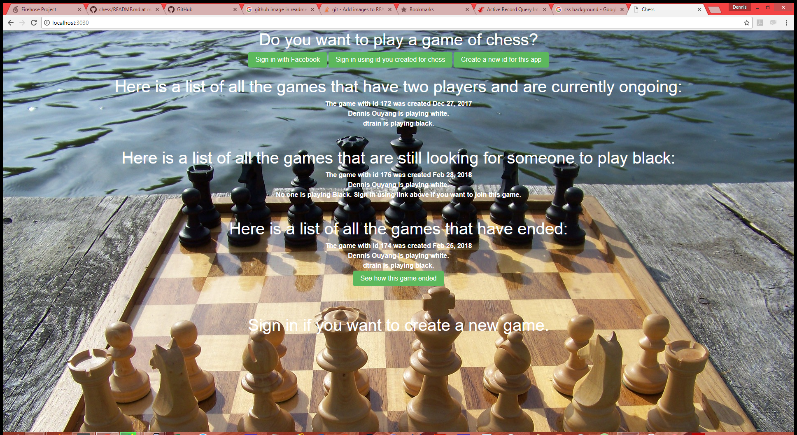

Play a game of chess with a human opponent. Login using facebook or create your own user id for this app. Once logged in, you can 

1. Create a new game playing the white chess pieces while your opponent will play black. (Your opponent will need to login and click the button to join the game you have created before his side can move)

2. Join an existing game as the new black player.

3. Continue a game where both white and black pieces have players assigned already.

